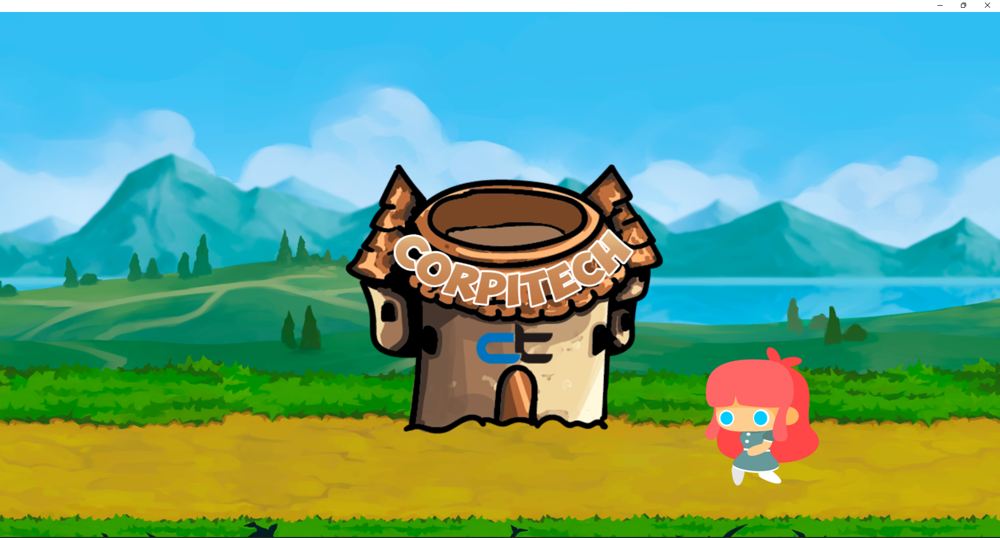
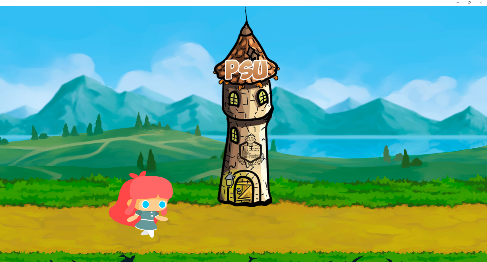

# Client - Server Application

Это приложение было разработано для открытия [совместной лабаратории ПГУ(Полоцкий государственный университет) и компанией Corpitech](https://gorod214.by/new/8760). Для приложения была разработана [клиентская](/ClientPart/)  и [серверная](/ServerPart/) часть которые взаимодействуют между собой через вычислительную сеть посредством сетевых протоколов.

## Example client part

